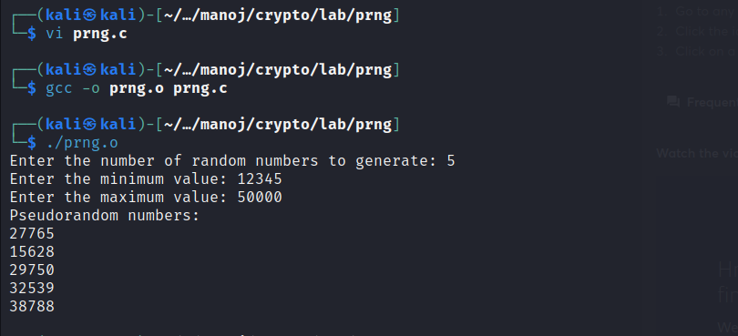

# Ex6_PseudoRandomNumberGeneration

## ALGORITHM:
1) Start the program and import the required libraries.
2) Seed the random number generator using the current time(i.e)
rand(time(0));
3) Get the number of randon number to generate.
4) Pass the value for number of iterations and print the numbers.
5) End the program.
## PROGRAM:
```c
#include <stdio.h>
#include <stdlib.h>
#include <time.h>
int main() 
{
    int count, min, max;
    printf("Enter the number of random numbers to generate: ");
    scanf("%d", &count);
    printf("Enter the minimum value: ");
    
    scanf("%d", &min);
    printf("Enter the maximum value: ");
    scanf("%d", &max);
    srand(time(NULL));
    printf("Pseudorandom numbers:\n");   
    for (int i = 0; i < count; i++) 
    {
        int random_number = (rand() % (max - min + 1)) + min;
        printf("%d\n", random_number);
    }
    return 0;
}
```
## OUTPUT:

## RESULT:
The implementation of Pseudorandom Number Generation using Standard library is successful.